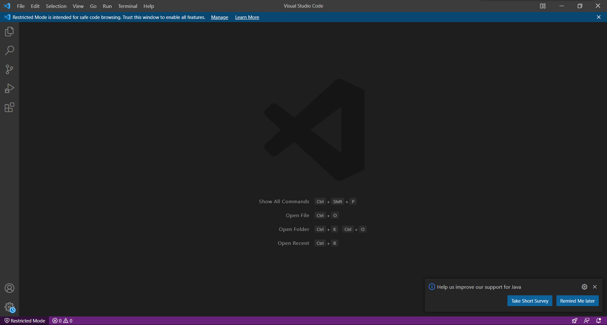
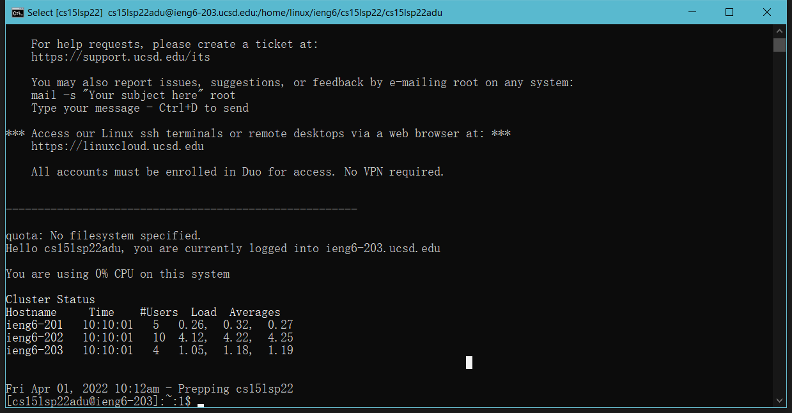
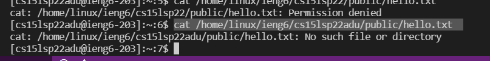
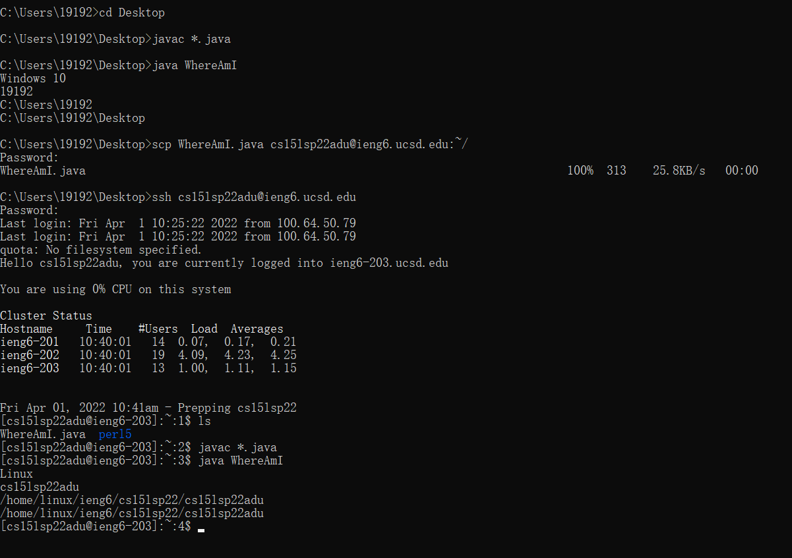
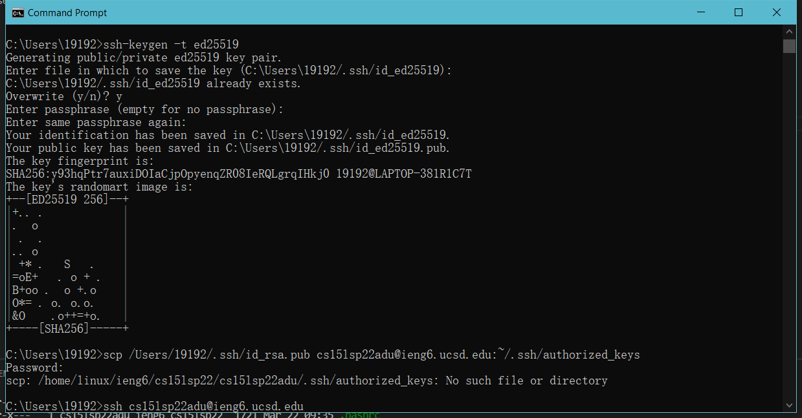

Firstly, download and install the VSCode(Visual Studio Code) from the [website](https://code.visualstudio.com/), and the start page should be something similar to this: 


Then, we want to remotely connect our computer to our course-specific accounts. If you do not know your username for this class, go to [here](https://sdacs.ucsd.edu/~icc/index.php) to login to your ucsd account and find your username for this class specificly. 
Then, go to terminal and type in 
```
# code block
ssh cs15lsp22zz@ieng6.ucsd.edu
```
remember that "zz" should be replaced by the letters in your username
when you type your password, it will not be shown on the screen, it is totally normal
the outcome should be something like this:


Then, we can try some commands on the remote access. For example, cd, ls, pwd, mkdir, and cp. Here is an example: 


Now, we can try to move some files between local and remote computers with the scp command. Create a file called WhereAmI.java on your computer. Write the following code in it: 
```
# code block
class WhereAmI {
  public static void main(String[] args) {
    System.out.println(System.getProperty("os.name"));
    System.out.println(System.getProperty("user.name"));
    System.out.println(System.getProperty("user.home"));
    System.out.println(System.getProperty("user.dir"));
  }
}

```
Then, in the terminal, go to the directory where you made this file, first run javac and java on the local computer and check the resulte. Then run the following command:
```
# code block
scp fileName.java cs15lsp22zz@ieng6.ucsd.edu:~/
```

Then, on the remote computer, run javac and java and check the resulte, you will see some difference like this: 


Now, we can try to set up a SSH key, which allow us not to type the password everytime we make come command. On your computer, run the command: 
ssh-keygen
Generating public/private rsa key pair.
Enter file in which to save the key (/Users/<user-name>/.ssh/id_rsa): /Users/<user-name>/.ssh/id_rsa
Enter passphrase (empty for no passphrase):
**Remember add no passphrase here**
Enter same passphrase again: 
Your identification has been saved in /Users/<user-name>/.ssh/id_rsa.
Your public key has been saved in /Users/<user-name>/.ssh/id_rsa.pub.
The key fingerprint is:
SHA256:jZaZH6fI8E2I1D35hnvGeBePQ4ELOf2Ge+G0XknoXp0 <user-name>@<system>.local
The key's randomart image is:
+---[RSA 3072]----+
|                 |
|       . . + .   |
|      . . B o .  |
|     . . B * +.. |
|      o S = *.B. |
|       = = O.*.*+|
|        + * *.BE+|
|           +.+.o |
|             ..  |
+----[SHA256]-----+

For this step, if you are on windows system, just run the command: 
```
# code block
ssh-keygen -t ed25519
```
Then, run the following command: 
```
# code block
$ ssh cs15lsp22zz@ieng6.ucsd.edu
<Enter Password>
# now on server
$ mkdir .ssh
$ <logout>
# back on client
$ scp /Users/<user-name>/.ssh/id_rsa.pub cs15lsp22zz@ieng6.ucsd.edu:~/.ssh/authorized_keys
# You use your username and the path you saw in the command above
```
The outcome will look similar to this: 

Now, you should be able to use scp and ssh without entering the password again and again. 