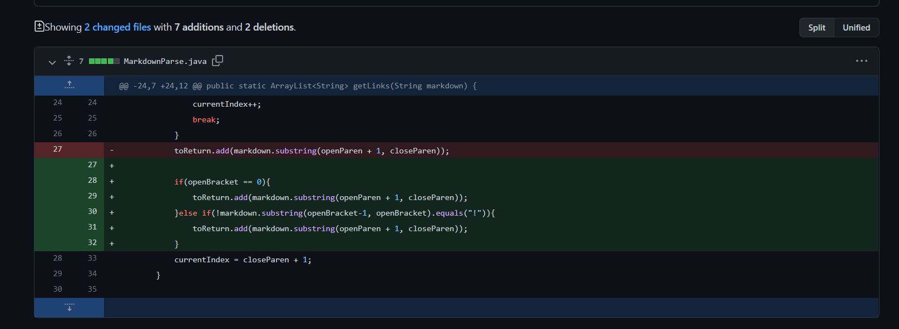

# Code 1

Here is the code from our group member Dominic Feliton. 

Here is the link to the test file for this code. 
[test-file](https://github.com/dfeliton/markdown-parser/commit/2636d40ea59b6d3211291d4c18f07343ddb6b7bd)

Here is the error message (symptom) that this failure-inducing input gives back. 

The failure-inducing input here is that one of the link lines misses the "[]" signal for link. This causes the system to get into an infinite loop because the while loop in MarkdownParse cannot find the "[]" so it will return -1 for currentIndex and then the while loop will never stop because currentIndex will always be smaller than markdown.length. 

# Code 2

Here is the code from our group member Kevin Ly. 

Here is the link to the test file for this code. 
[test-file](https://github.com/lykevin2341/markdown-parser/commit/266c73d43e7cfb0738c7c97a07acfa7316da71f5)

Here is the error message (symptom) that this failure-inducing input gives back. 

The failure-inducing input here is that there are ";" after each line of code, which are symbols that are in no need. It cause an infinite loop error because there is an extra ";" in the end so when the closeParen is initialized, it will be set to ";" when the for loop goes to the last time, so the while loop will return -1 this time because it is a ";", and then the -1 will cause the infinite while loop because -1 will always be smaller than markdown.length. 

# Code 3

Here is the code from myself. 

Here is the link to the test file for this code. 
[test-file](https://github.com/Ruojiang-Zhang/markdown-parser/commit/440ed5c3fc96dc7403091434e37554a8aaa7ef82)

Here is the error message (symptom) that this failure-inducing input gives back. 

The failure-inducing input here is that there misses one of the "]" and there is also an image in the file, which is not a link. There are two symptoms. The first is that it will cause an infinite loop, which has the same reason as the first example code. The second is that the result outcome will include image in it. It is because the code cannot distinguish between image file and link file. 